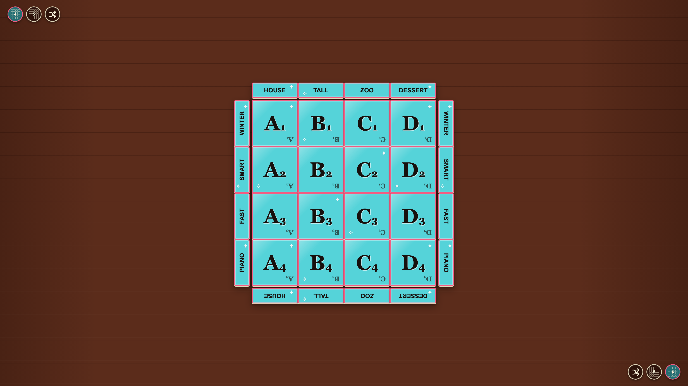
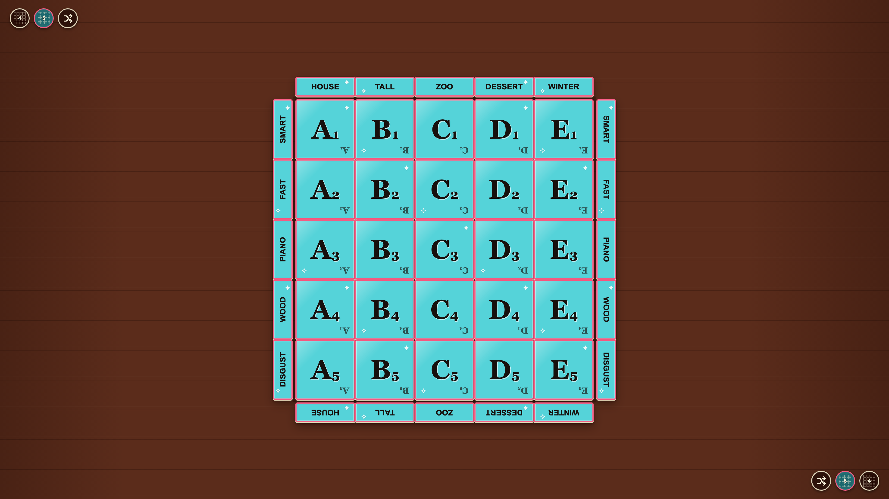

# Board layout

Players can set up either supported board size with physically accurate card spaces and mirrored word headers.

## The table opens with the standard four by four layout

**Verifications:**

- [x] There are sixteen grid cards
- [x] Coordinates cover A1 through D4
- [x] Each card is 60 mm wide at 109 pixels per inch
- [x] Each card is 60 mm tall at 110 pixels per inch
- [x] The word rail is one-third of a grid card deep
- [x] Border cards contain words without duplicate coordinate labels
- [x] Four distinct column words and four distinct row words are dealt

---

## A player expands the table to five by five

**Verifications:**

- [x] There are twenty-five grid cards
- [x] Coordinates now cover A1 through E5
- [x] The card dimensions remain physically unchanged
- [x] The five by five choice is active at both table edges
- [x] E and 5 each have a visible word
