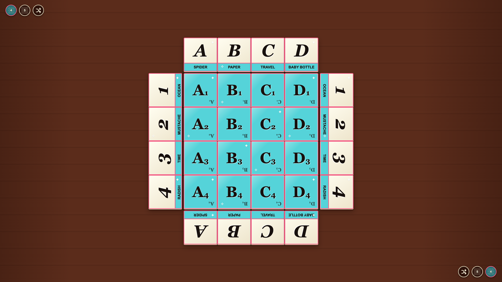
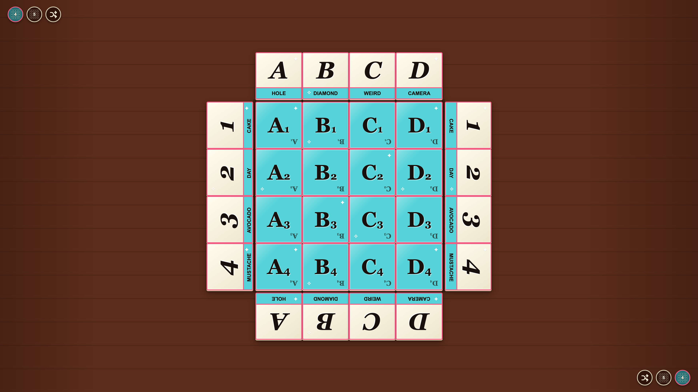

# Word deal

Either side of the table can deal new distinct words from the reference game list.

## The initial border words come from the reference list

**Verifications:**

- [x] Every dealt word belongs to BASE_WORDS
- [x] No word is repeated in the deal
- [x] Top words are mirrored along the bottom edge
- [x] Left words are mirrored along the right edge

---

## A player deals new words from the upper edge

**Verifications:**

- [x] The complete word deal changes
- [x] The board coordinates do not change
- [x] The deal counter advances exactly once
- [x] The new deal remains distinct

---

## A player can also deal from the opposite table edge

**Verifications:**

- [x] The opposite control advances the deal
- [x] Both shuffle controls remain available
- [x] Mirrored headers still contain matching words
