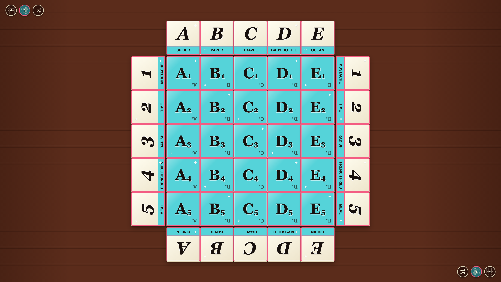

# Tabletop persistence

The current setup survives a reload and controls remain reachable from opposing seats.

## A player configures the board from the opposite seat

**Verifications:**

- [x] The board changes to five by five
- [x] The deal advances
- [x] Every round control exceeds the 60 pixel tabletop touch minimum
- [x] Bottom and right header content faces the opposite seat

---

## The tabletop restores the setup after a reload

**Verifications:**

- [x] The five by five size is restored
- [x] The same word deal is restored
- [x] Both edge selectors reflect the restored size
- [x] No page scrolling is introduced
